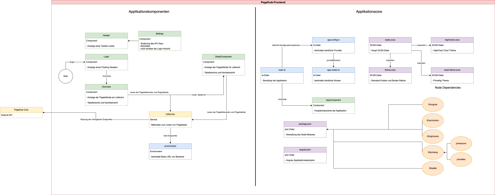

# Pegelhub

This project contains the dedicated Angular application for the Pegelhub project.

## Architecural Overview

## Theming
The application provides theming support in two different ways:
- theme.scss
- base-theme.scss

### theme.scss
The main theme file provides scss-variables used for coloring and shaping HTML elements. In order to change these parameters, the actual values need to be provided for the given SCSS variables.

### base-theme.scss
This is the PrimeNG main theme which is responsible for the general styling of the application. Here, changes can be done to the PrimeNG style classes and rules.

## Deployment
To deploy the application on a web server, follow the instructions below. The application is deployed and made available in a docker container.

### Prerequisites
Make sure that the following software is installed on your system:
- Docker Desktop: `https://www.docker.com/get-started`

### Configure Environment
- In Angular, environments are used to define which configuration should be used for which environment.
- The following environment file is used for the deployment via Docker: `environment.prod.ts`
- Inside this particular file the endpoint of the API is stored in the variable `BASE_URL`.

### Involved files
- Navigate to the root directory of your Angular app.
- Here we find a `docker-compose.yml` file and a `Dockerfile` which are both needed for a functioning deployment.
- `docker-compose.yml` defines which containers are to be created
- `Dockerfile` defines a series of commands that initiate the build, copy the resulting source and finally start the container.

### Startup Procedure
1. Start `Docker Desktop` on your local machine and wait until it has booted successfully.
2. Afterward the container can be built with the command `docker-compose build`. This will take some time depending on the power of your system.
3. It is finished once the docker image `nginx` appears in the `Images` section of Docker Desktop.
4. You can then start it with `docker-compose up` or stop it with `docker-compose down`.
5. To make sure the application is running correctly, take a look at `Containers` inside Docker Desktop. Here you should see the container `pegelhub-frontend` and a green icon on the left.
6. After the container has been successfully started with `docker-compose up`, the application is accessible under port 80.

## Running the application locally

Run `ng serve` for a dev server. Navigate to `http://localhost:4200/`. The application will automatically reload if you change any of the source files.

## Code scaffolding

Run `ng generate component component-name` to generate a new component. You can also use `ng generate directive|pipe|service|class|guard|interface|enum|module`.

## Build

Run `ng build` to build the project. The build artifacts will be stored in the `dist/` directory.

## Component Tests

Run `ng test` to execute the component tests via [Karma](https://karma-runner.github.io).

## Unit tests

Make sure the application is running in the background with `ng start`

Once it is up and running you can run `ng pw-test` to execute the unit tests via [Playwright](https://playwright.dev).

**Note**: 

Playwright may ask you to first install playwright appropriately.
If that is the case, the command `npx playwright install` has to be executed before running the tests.

## Compodoc

Serves as a documentation tool for this Angular application.
Based on the source code it generates a good-looking and easy-to-understand documentation that is easily accessible.

### Build

Execute the command `ng compodoc:build` to generate the documentation.

### Serve

Execute the command `ng compodoc:serve` to serve the documentation and gain access to it.
The documentation should be available on port **8080**.

**Note**

The build command should always be executed before starting with the serve procedure.
If this is not the case, the documentation will not be accessible.

### Build and Serve (combined)

Execute the command `ng compodoc:build-and-serve` to combine the build and serve procedures into one step.

## Highcharts

Represents a JavaScript charting library based on SVG and some canvas/WebGL.
Used to show all kind of diagrams and charts across the application.
